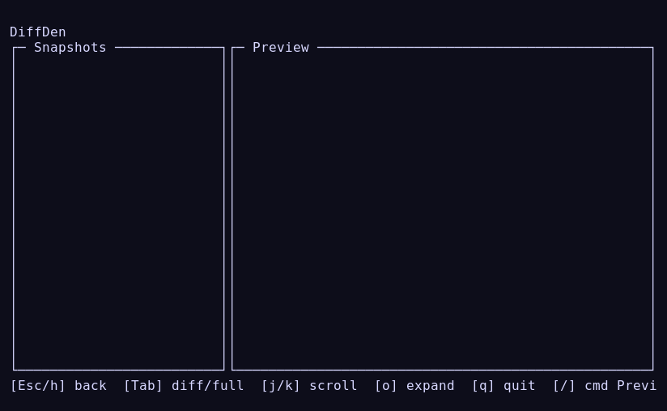
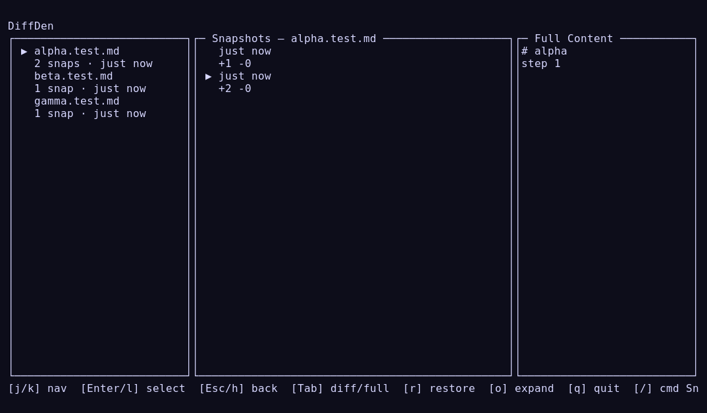
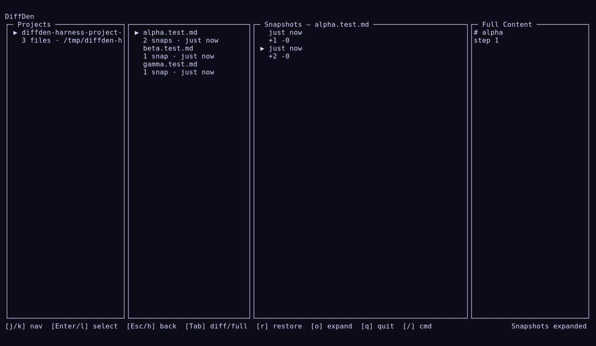

# Multi-file Harness Artifacts (2026-02-10)

Generated with:

```bash
bun bin/tui-harness.ts smoke \
  --scenario=multi-file \
  --sizes=80x24,105x30,140x40 \
  --out=docs/pr-artifacts/multi-file-smoke-2026-02-10
```

Scenario behavior:
- preconfigures three watched files: `alpha.test.md`, `beta.test.md`, `gamma.test.md`
- mutates each file to trigger snapshots
- navigates files/snapshots/preview and toggles preview mode

Run summary:
- `summary.json`
- `REPORT.md`

Viewport images:
- 80x24



- 105x30



- 140x40



Additional raw/text artifacts are included in this folder for each viewport.
